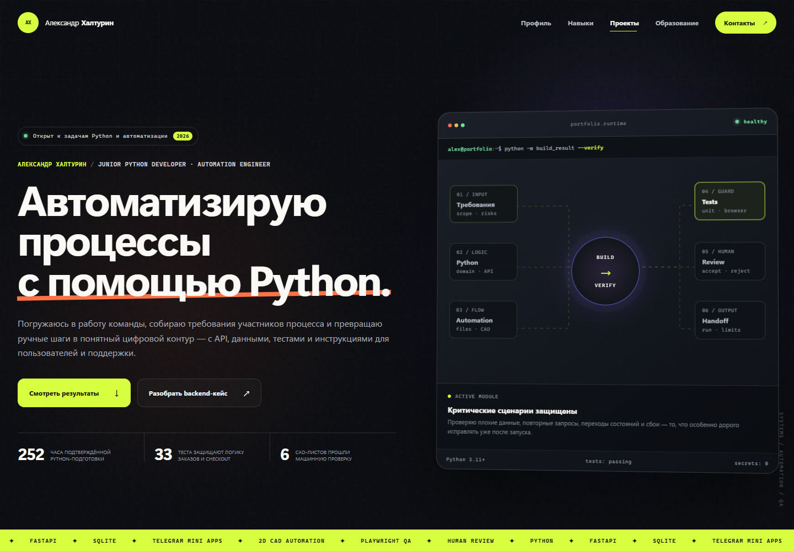

# Alexander Khalturin — Portfolio Site

<p align="center">
  <strong>Разработчик систем автоматизации · Python / AI</strong><br>
  Персональный сайт о проверяемых Python, backend и automation‑проектах.
</p>

**Контакты:** [Telegram @kotosrol](https://t.me/kotosrol) · [krixkotosrol@gmail.com](mailto:krixkotosrol@gmail.com) · Санкт‑Петербург · полная занятость · 5/2

**PDF‑резюме:** [единое резюме разработчика систем автоматизации](resume/alexander-khalturin-automation-developer.pdf)

<p align="center">
  <a href="https://kotosrol.github.io/alex-portfolio-site/"></a>
  <a href="https://github.com/kotosrol/alex-portfolio-site/actions/workflows/ci.yml"></a>
  
  
  
  
</p>



## Задача сайта

**Live:** https://kotosrol.github.io/alex-portfolio-site/

Не перечислять технологии, а показать работодателю полный рабочий контур:

```text
процесс → участники → требования → Python/backend → проверки → запуск и поддержка
```

Каждый проект разделяет личный вклад Александра, AI‑assisted реализацию, наблюдаемый результат и границу готовности. Учебные кейсы не выдаются за коммерческие, прототипы — за production.

## Что реализовано

- технический dark hero с интерактивной runtime‑архитектурой;
- профиль и рабочий процесс глазами нанимающего руководителя;
- фильтруемые карточки backend/automation‑проектов;
- четыре подробных case study;
- code-native визуалы без фотостоков и UI‑framework;
- адаптивная композиция от 390 до 1440 px;
- клавиатурная навигация, skip link и `prefers-reduced-motion`;
- локальные системные шрифты с корректной кириллицей;
- отсутствие аналитики, форм, cookies и внешних runtime‑зависимостей.

## Selected cases

| Case | Что показывает |
|---|---|
| [Telegram Store Reconstruction](projects/telegram-store-reconstruction.html) | Mini App, FastAPI, SQLite, идемпотентный checkout, статусы и 33 теста |
| [2D CAD Automation](projects/cad-automation-pipeline.html) | JSON → DXF/SVG/DWG, machine QA, PowerShell и AutoLISP |
| [3‑НДФЛ operator MVP](projects/3ndfl-operator-mvp.html) | fail‑closed document pipeline и human review |
| [Power Supply Diploma](projects/power-supply-diploma.html) | связность расчётов, схем и технических документов |

## Проверенный срез

Browser QA прогоняет главную и четыре технические страницы на desktop/mobile:

- HTTP 200;
- console/page errors: **0**;
- failed requests: **0**;
- broken internal links: **0**;
- horizontal overflow: **0**;
- duplicate IDs: **0**;
- мобильное меню, фильтры, runtime и keyboard flow работают;
- reduced motion оставляет контент видимым и отключает необязательное движение.

## Запуск

```powershell
python -m http.server 4173
```

Открыть `http://127.0.0.1:4173/`.

Сборка не требуется: сайт состоит из HTML, CSS, JavaScript и локальных SVG/PNG‑assets.

## Структура

```text
.
├── index.html
├── styles.css
├── project.css
├── app.js
├── projects/
│   ├── telegram-store-reconstruction.html
│   ├── cad-automation-pipeline.html
│   ├── 3ndfl-operator-mvp.html
│   └── power-supply-diploma.html
├── assets/
└── scripts/check-site.cjs
```

## Связанные репозитории

- [telegram-store-reconstruction](https://github.com/kotosrol/telegram-store-reconstruction)
- [cad-automation-demo](https://github.com/kotosrol/cad-automation-demo)

## Граница публикации

Публичные контакты подтверждены владельцем. В репозитории нет сканов дипломов, номеров документов, клиентских данных, cookies, токенов и исходных материалов закрытых проектов.
